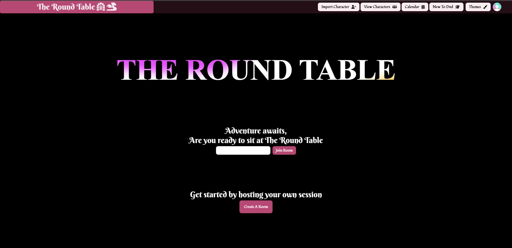
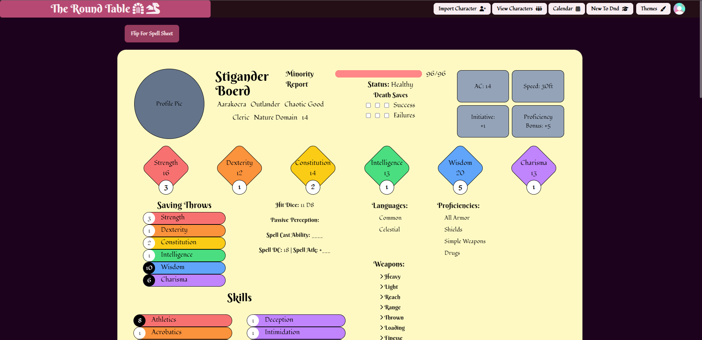
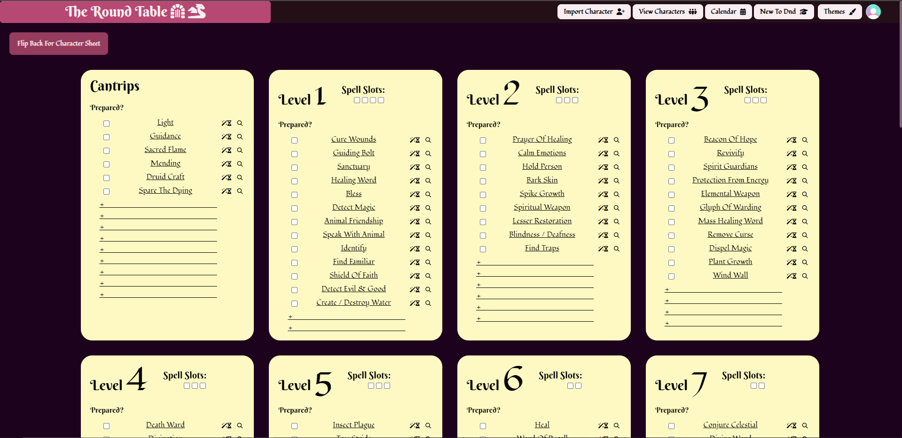
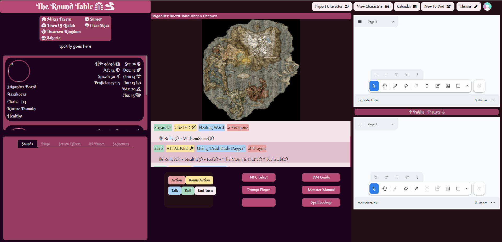
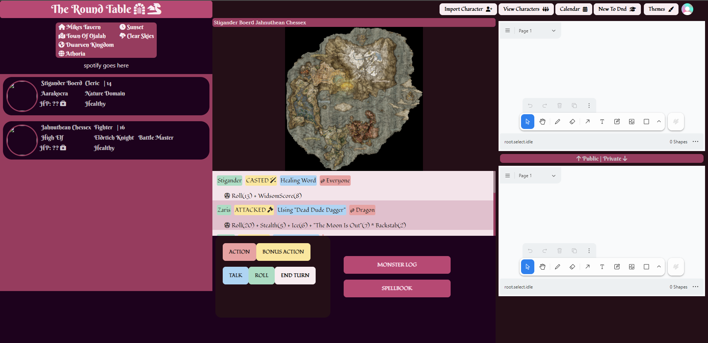

   
  

## 🗺️ Table of Contents

- [Introduction](#introduction)
- [Features](#features)
- [How to Use](#how-to-use)
- [Tech Stack](#tech-stack)
- [Contributing](#contributing)
- [Our Experience](#our-experience)
- [License](#license)

## 📜 Introduction

Welcome to **The Round Table**, a platform designed for Dungeon Masters (DMs) and players who love Dungeons & Dragons (D&D). Our platform aims to replicate the feel of an IRL D&D session through a suite of powerful tools that offer customization, control, and immersion. Forget the hassle of jumping between multiple apps; our integrated dashboard streamlines the gameplay, enriches storytelling, and even automates some processes.

## 🔮 Features

### 🛡️ User-Friendly Dashboard

- **Account Creation**: Easy-to-use registration.
- **Character Sheet Uploading**:
  

### 👑 DM's Control Panel
- **DM Screen Customization**: Arrange widgets like initiative trackers, notes, and maps on your personal DM screen.
- **File Bin**: Upload and manage an array of resources—music, ambient sounds, maps, NPCs, and more.

### ✨ Dynamic Events

- **Event Sequencing**: DMs can pre-program events to trigger music, map changes, and screen effects in a sequence.
- **Timeline Web**: Craft a branching pathway of possible events based on player decisions or game milestones.

### 🎨 Whiteboard and Notebooks

- **Collaborative Whiteboard**: A real-time drawing board where players and DMs can sketch battle plans or illustrate scenarios.
- **Notebook**: Save important drawings or notes for future reference, equipped with folder categorization.

### 📝 Lore Moments

- **Pop-up Lore**: Broadcast critical or optional lore directly to players' screens.
- **Importance Levels**: Classify lore elements based on how crucial they are to the ongoing story.

### 📚 Digital Books

- **Monster Log**: DMs can update individual players' monster knowledge based on in-game experiences.
- **Character Journal**: A rich-text editor for players and DMs to document backstories, game events, and personal thoughts.
- **Spellbook**: A digital compendium of spells that get unlocked or updated as your character learns and grows.

## 👨‍🏫 How to Use

1. **Account Setup**: Register using your email and set up a secure password.
2. **Character Sheet Import**: Use the drag-and-drop interface to import your character sheet, which is then parsed and integrated into your dashboard.
3. **Party Time**: Accept an invitation to join a party or create your own and invite friends.
4. **Let the Adventure Begin**: Your DM will guide the session, but you're free to explore the suite of tools available to enhance your gameplay experience.

## 🛠️ Tech Stack

- **Front-end**: React.js.
- **Back-end**: Node.js with Express for API design.
- **Database**: Supabase for user data and session storage.
- **Whiteboard**: [tldraw](https://github.com/tldraw/tldraw) for the whiteboard component.

## 💌 Contributing

Contributions are more than welcome! If you have ideas for additional features or find bugs that need squishing, open an issue or pull request.

## 🧙‍♂️ Our Experience

### 🎒 Our Journey and Inspiration
The Round Table was born out of necessity and fueled by passion. As a solo full-stack developer with a deep-rooted love for D&D, I've always wanted to make the experience as seamless and engaging as possible.

### 🎯 The Origin Story
The pivotal moment came when one of our close friends moved away. We soon realized that online sessions, despite being the only viable option, lacked the fluidity and depth we were accustomed to in our in-person adventures. It didn't take long to understand: there had to be a better way.

### 👨‍💻 The Development Process
That's when I decided to take the plunge. I embarked on this ambitious project to build an all-encompassing platform for D&D aficionados like ourselves. I poured countless hours into creating an application that doesn't just replace the tabletop but enhances it. The goal? To mimic the feel of real-life sessions as closely as possible and add layers of interactivity and immersion that weren't feasible before.

### 💞 A Community Endeavor
While I've been steering the ship in terms of development, I've had unwavering support from my circle of D&D enthusiasts. They've been closely involved in the conceptualization and iterative testing phases, providing invaluable feedback to make sure The Round Table meets our high standards and expectations.

### 🚀 What's Next?
Currently, the platform is being fine-tuned based on our personal use-cases. However, the vision doesn't stop here. Once the game components have been finalized and rigorously tested, The Round Table will be opened up for the broader D&D community to use and enjoy.

###  🧝‍♀️🧚‍♂️🧛‍♂️🧜‍♀️Meet the Party
For those curious about the adventurers putting this platform to the test, let me introduce our homebrew campaign's valiant party members:

Stigander: That's me! I play a nature domain cleric, a snowy white owl focused on spreading good vibes, peace, and love for mushrooms and nature.

Bojack: A dark elf monk grappling with inner demons but striving for enlightenment one step at a time.

Zaris: Don't let his whimsical demeanor fool you; our dark elf rogue is a master of daggers and subterfuge.

Malarie: Our fearless barbarian with a penchant for chaos, causing all sorts of trouble for foes unlucky enough to cross our path.

By using The Round Table, we've managed to bring our characters and adventures to life like never before, all while setting a new standard for online D&D gameplay.

## ⚖️ License

This project is licensed under the MIT License - see the [LICENSE.md](LICENSE.md) file for details.

---

Made with 💚 by D&D enthusiasts.
