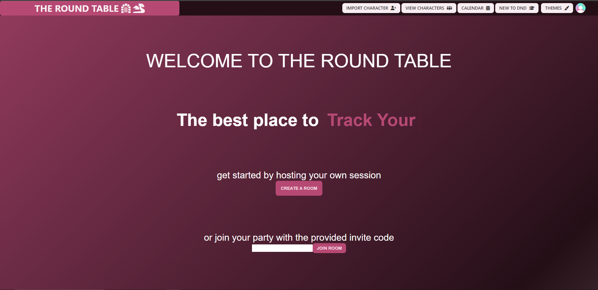
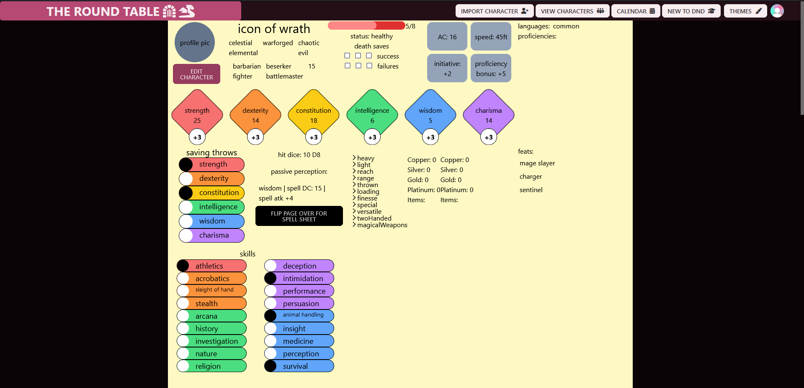
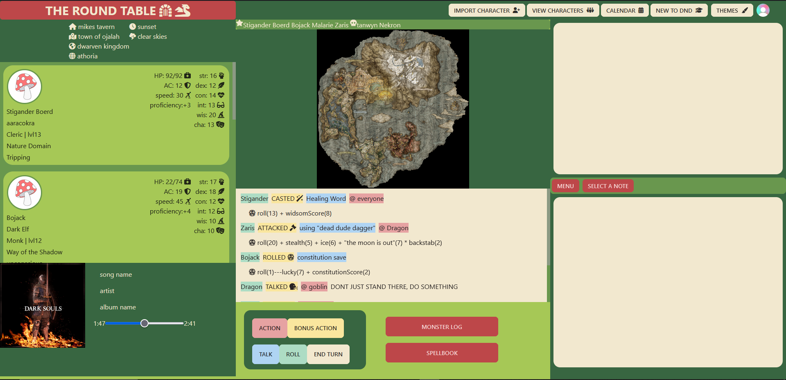
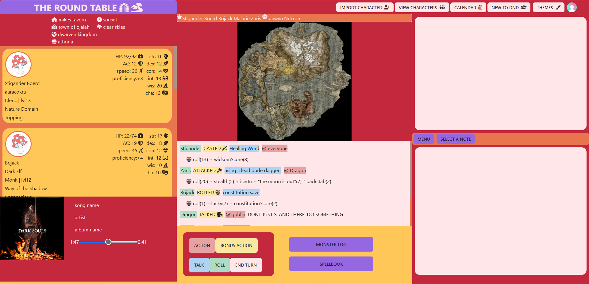
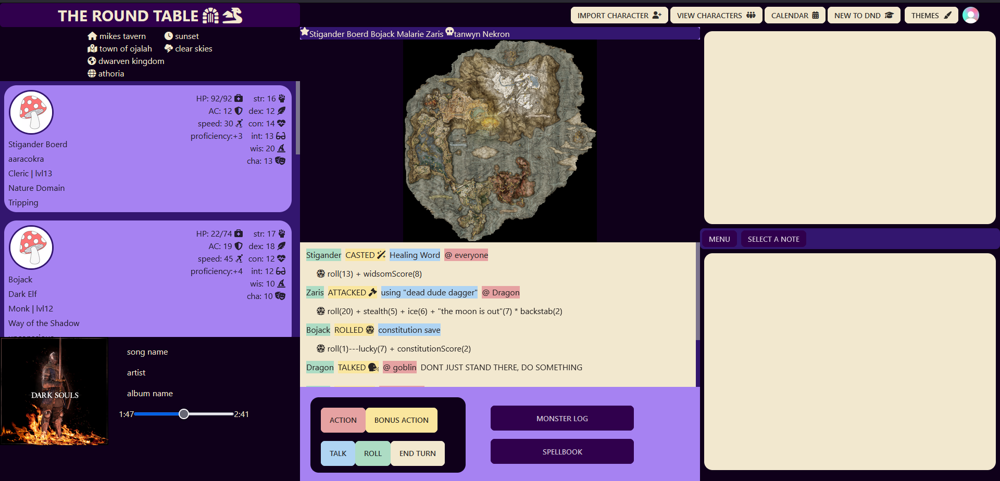
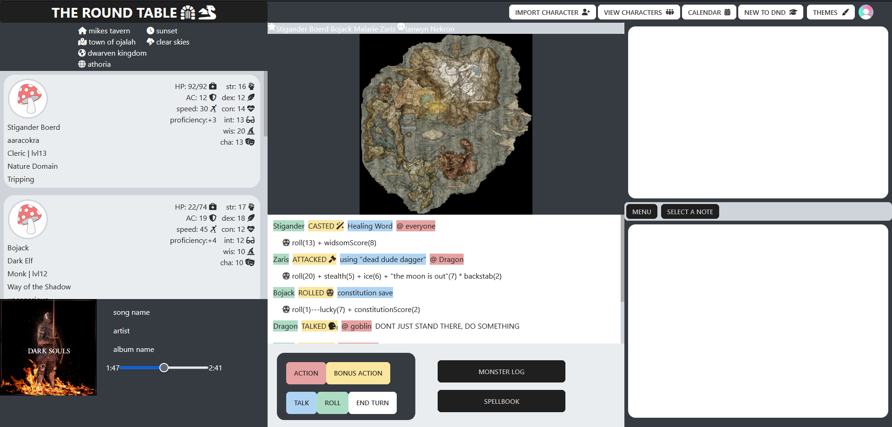

# The Round Table

The Round Table is your one stop hub space for running and tracking your table top role play session, right now only dnd e5 is supported, but there are plans to expand to more ttrpgs.

## Features

- Stored character and party data in a PostgreSQL database

- Real-time game interactions, and drawing using Socket.IO.
- Fast game log and game state updates using Redis.

- Multiple themes available

